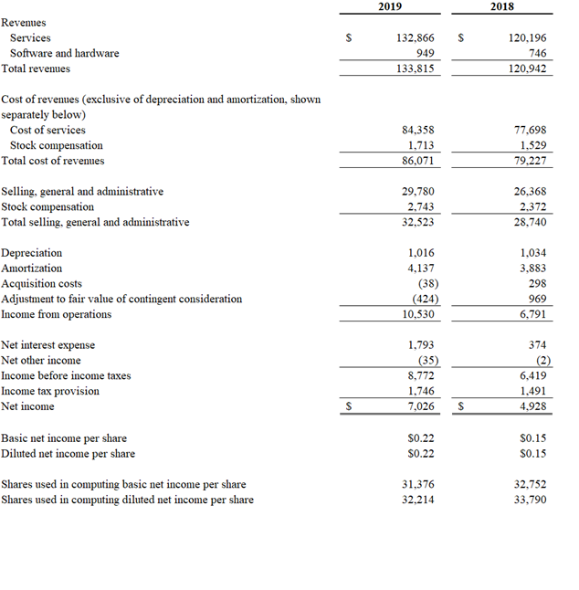
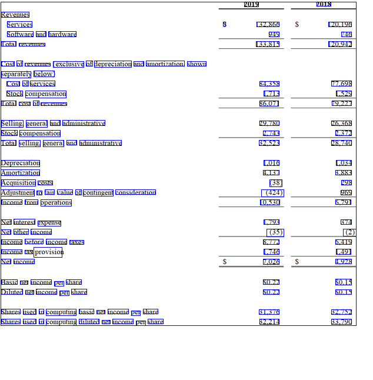

# Table-Data-Extraction-and-Heuristic-based-Structuring-using-GCP
Table Data Extraction and Heuristic based Structuring using GCP

    Note: This code not good at handling merging of columns and Rows issues.

To Run the Code: python imxls.py --ip=image_path
		
		>python imxls.py --ip=images/image_8.png

Tested On:
	Python: 3.6.8 
		>pillow: 5.4.1
		>pandas: 0.24.2'
		>numpy: 	1.16.4'

		>google-cloud-vision: pip install google-cloud-vision 

### Input Image:

### Text Detected Image

### Result

-|		-|2019|	2018
---| ---| ---| --- 
Revenues|			
Services|	S|	132,866|	120,196
Software and hardware|		|949|	746
Total revemes|		|133,815|	120,942
Cost of revenues (exclusive of depreciation and amortization, shown|
separately below)|
Cost of services|		|84,358|	77,698
Stock compensation|		|1,713|	1,529
Total cost of revenues|		|86,071|	79,227
Selling, general and administrative|		|29,780|	26,368
Stock compensation|		|2,743|	2,372
Total selling, general and administrative|		|32,523|	28,740
Depreciation|		|1,016|	1,034
Amortization		4,137	3,883
Acquisition costs		(38)	298
Adjustment to fair value of contingent consideration		(424)	969
Income from operations		10,530	6,791
Net interest expense		1,793	374
Net other income		(35)	(2)
Income before income taxes		8,772	6,419
Income tax provision		1,746	1,491
Net income		7,026	4,928
Basic net income per share		$0.22	$0.15
Diluted net income per share		$0.22	$0.15
Shares used in computing basic net income per share		31,376	32,752
Shares used in computing diluted net income per share		32,214	33,790
